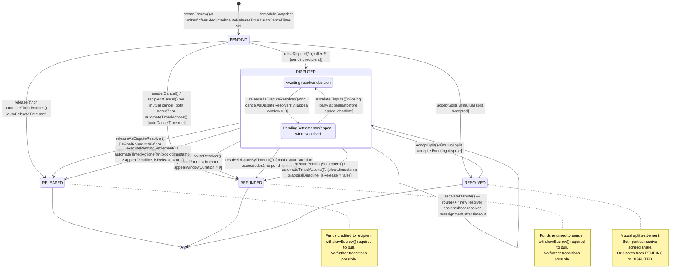
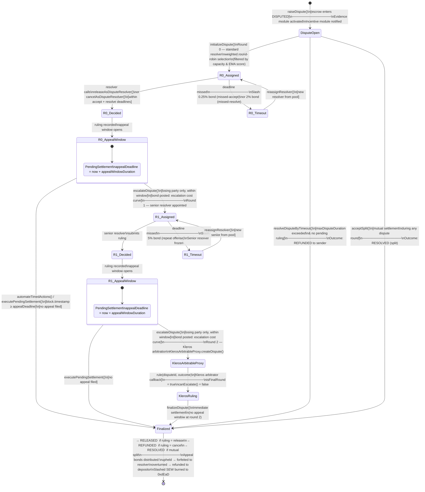

# Sew Protocol — State Diagrams

> Two Mermaid diagrams derived directly from the contract source.
>
> **Sources:**
> `contracts/types/EscrowTypes.sol` (state enum),
> `contracts/core/BaseEscrow.sol` (transitions and guards),
> `contracts/libraries/StateManagementLibrary.sol`,
> `contracts/ops/DisputeOps.sol`,
> `contracts/ops/SettlementOps.sol`,
> `contracts/modules/decentralized-resolution-module/DecentralizedResolutionModule.sol`,
> `contracts/arbitration/KlerosArbitrableProxy.sol`.
>
> For the full narrative reference see [`docs/STATE_MACHINE.md`](STATE_MACHINE.md) and
> [`docs/dispute-resolution/DISPUTE_RESOLUTION_ARCHITECTURE.md`](dispute-resolution/DISPUTE_RESOLUTION_ARCHITECTURE.md).

---

## 1. Core escrow state machine



### Transition authority

| Transition | Who may trigger |
|---|---|
| `NONE → PENDING` | Any address (pays into escrow) |
| `PENDING → RELEASED` | Recipient (via release strategy); or `sender`/`recipient`/`KEEPER`/`TIMELOCK` for timed auto-release |
| `PENDING → REFUNDED` | Sender (unilateral, if strategy permits); Recipient (unilateral); or both consent (mutual cancel); or `sender`/`recipient`/`KEEPER`/`TIMELOCK` for timed auto-cancel |
| `PENDING → DISPUTED` | Sender or recipient only |
| `PENDING/DISPUTED → RESOLVED` | Counterparty to whoever called `proposeSplit()` |
| `DISPUTED → RELEASED/REFUNDED` (immediate) | Authorised resolver (snapshotted at dispute open) |
| `DISPUTED → RELEASED/REFUNDED` (after window) | `sender`/`recipient`/`KEEPER`/`TIMELOCK` |
| `DISPUTED → REFUNDED` (timeout) | `sender`/`recipient`/`KEEPER`/`TIMELOCK` |

**Resolver authority is locked at dispute open.** The resolver recorded in
`et.disputeResolver` at `raiseDispute()` is the only address that may submit a ruling
for that escrow — module or governance changes after that point have no effect.

---

## 2. Dispute escalation and appeals



### Escalation bond outcomes

When an appeal bond is forfeited or refunded at finalization:

| Outcome | Bond fate |
|---|---|
| Round `n` decision **upheld** (escalation was wrong) | Bond forfeited → distributed to the resolver whose decision was validated at round `n−1` |
| Round `n` decision **overturned** (escalation was correct) | Bond refunded → returned to the depositor |

A `bondRefundedAtRound[n]` flag is stored per dispute for auditability.

### Slashing schedule

| Offense | Slash rate | Epoch cap |
|---|---|---|
| Missed accept | 0.25% of bond | 20% per 7-day epoch |
| Missed resolve (first) | 2% of bond | 20% per 7-day epoch |
| Missed resolve (repeat) | 5% of bond | 10% per 7-day epoch |
| Per-slash absolute maximum | 50% of bond | — |

Slashed SEW is burned. Double-slashing for the same offense is prevented by
`AlreadySlashedForWorkflow` check.

### Escalation cost curve (default: quadratic)

```
cost(k) = baseCost + stepSize × k²
          where k = escalation count (0-indexed)
```

Each successive appeal is more expensive than the last. A party repeatedly
appealing correct decisions will exhaust their bond balance faster than they
can win.

### canEscalate() contract

`KlerosArbitrableProxy.canEscalate()` always returns `(false, _, _)`. Round 2 is
structurally terminal: no further appeal path exists within the protocol.
