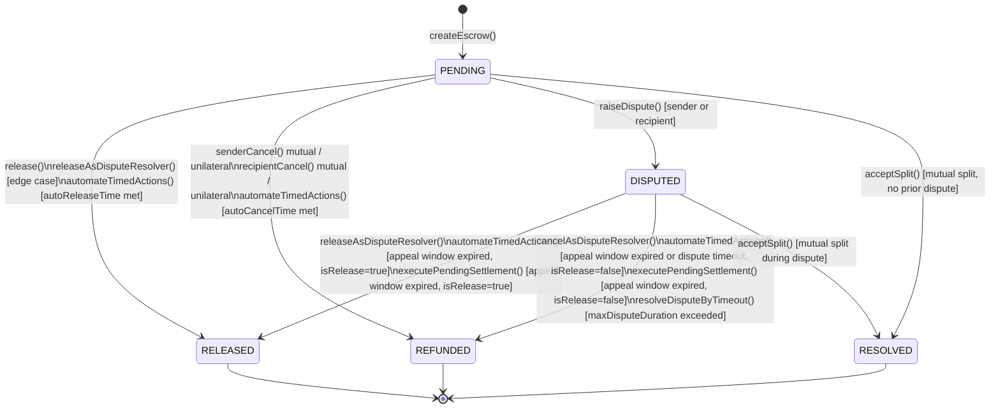

# Escrow State Machine

> **Scope:** This document is a complete reference for the escrow state machine in the
> Sew Protocol. It covers every state, every transition, every guard condition, and the
> sub-state model that sits within `DISPUTED`.
>
> **Sources:** `contracts/core/BaseEscrow.sol`, `contracts/libraries/StateManagementLibrary.sol`,
> `contracts/types/EscrowTypes.sol`, `contracts/ops/SettlementOps.sol`.

---

## 1. State Enum

```solidity
enum EscrowState {
    NONE,      // 0 — slot not yet initialised
    PENDING,   // 1 — funds held; awaiting release, cancellation, or dispute
    RELEASED,  // 2 — terminal: funds credited to recipient
    REFUNDED,  // 3 — terminal: funds credited back to sender
    DISPUTED,  // 4 — in active dispute; resolver or timeout will settle
    RESOLVED   // 5 — terminal: split settlement accepted by both parties
}
```

`NONE` is the implicit zero value of the mapping slot. It is never written
explicitly; it is only meaningful as "this workflow ID does not exist."

`RELEASED`, `REFUNDED`, and `RESOLVED` are all terminal states.
No transition out of any terminal state is possible.

---

## 2. Full State Transition Diagram



---

## 3. States in Detail

### PENDING

The normal operating state. Funds are held in the contract.
Either participant may propose actions; none take effect until conditions are met.

**What is true in this state:**
- `amountAfterFee` is held and tracked in `escrowBalances[token]`
- `autoReleaseTime` and `autoCancelTime` are set (or 0 if disabled)
- Module snapshot is fixed (`moduleSnapshots[workflowId]`)
- Governance cannot alter terms for this escrow

**What can happen:**
| Action | Who | Outcome |
|--------|-----|---------|
| `release()` | Recipient (or release strategy) | → RELEASED |
| `senderCancel()` | Sender | → REFUNDED (unilateral if strategy allows) or sets `SenderStatus.AGREE_TO_CANCEL` |
| `recipientCancel()` | Recipient | → REFUNDED (unilateral if strategy allows) or sets `RecipientStatus.AGREE_TO_CANCEL` |
| Mutual cancel | Both agree | → REFUNDED |
| `raiseDispute()` | Sender or Recipient | → DISPUTED |
| `proposeSplit()` | Either party | Records split proposal (state unchanged) |
| `acceptSplit()` | Counterparty | → RESOLVED |
| `automateTimedActions()` | `et.from`, `et.to`, `ROLE_KEEPER`, `ROLE_TIMELOCK` | → RELEASED or REFUNDED |

---

### DISPUTED

The dispute state. The `EscrowState` field equals `DISPUTED`, but the dispute
subsystem models several logical phases internally using `PendingSettlement` and
`disputeRaisedTimestamp`.

**What is true in this state:**
- `disputeRaisedTimestamp[workflowId]` is set at the moment of transition
- `et.disputeResolver` is fixed to the resolver assigned at dispute opening
  (governance cannot replace it mid-dispute — S26 sandwich mitigation)
- Module snapshot continues to govern which resolver module is used

**What can happen:**
| Action | Who | Outcome |
|--------|-----|---------|
| `releaseAsDisputeResolver()` | Authorised resolver | Records ruling → PendingSettlement (or immediate if final round) → RELEASED |
| `cancelAsDisputeResolver()` | Authorised resolver | Records ruling → PendingSettlement (or immediate if final round) → REFUNDED |
| `executePendingSettlement()` | `et.from`, `et.to`, `ROLE_KEEPER`, `ROLE_TIMELOCK` | → RELEASED or REFUNDED (appeal window must be expired) |
| `automateTimedActions()` | Same callers | Pending settlement execution or dispute timeout → RELEASED or REFUNDED |
| `resolveDisputeByTimeout()` | Same callers | → REFUNDED (only if `maxDisputeDuration` exceeded and no pending ruling) |
| `proposeSplit()` | Either party | Records split proposal (state unchanged; blocked if pending ruling exists) |
| `acceptSplit()` | Counterparty | → RESOLVED |

**Sub-state: appeal window**

When a resolver submits a ruling (`releaseAsDisputeResolver` /
`cancelAsDisputeResolver`) and the round is not final, the escrow does not
settle immediately. Instead:

1. `PendingSettlement{exists: true, isRelease, appealDeadline}` is created.
2. The escrow remains in `DISPUTED` with a pending ruling in-flight.
3. Anyone may call `executePendingSettlement()` or `automateTimedActions()`
   after `block.timestamp >= appealDeadline` to execute the ruling.
4. If a split is accepted before the appeal deadline, the `PendingSettlement`
   is cleared and the split takes precedence (→ RESOLVED).

If the resolution module implements `getAppealDeadlineAndRound(uint256,address)`,
the per-round appeal deadline returned by the module governs. Otherwise, the
snapshotted `appealWindowDuration` is used as a fallback.

If the module signals `isFinalRound = true`, the ruling is executed immediately
with no appeal window.

---

### RELEASED (terminal)

Funds are credited to the recipient (`et.to`).
No further state transition is possible.

Claimable balance is created via `_creditClaimable`. The recipient calls
`withdrawEscrow(workflowId)` to pull funds. The state machine has already
finalised before that call.

---

### REFUNDED (terminal)

Funds are credited back to the sender (`et.from`).
No further state transition is possible.

Same pull-model as RELEASED — `withdrawEscrow(workflowId)` is required.

---

### RESOLVED (terminal)

A mutual split settlement was accepted by both parties.
Both sender and recipient receive their agreed share.

`RESOLVED` is distinct from `RELEASED` and `REFUNDED` because:
- It can originate from either `PENDING` or `DISPUTED`
- Both parties receive funds in the same transaction
- A dispute (if active) is closed in the resolution module before transition

No further state transition is possible.

---

## 4. Participant Status Sub-State (PENDING only)

Independent of `EscrowState`, each party tracks a consent flag used for
mutual-cancel coordination:

```solidity
enum SenderStatus    { NONE, AGREE_TO_CANCEL, RAISE_DISPUTE }
enum RecipientStatus { NONE, AGREE_TO_CANCEL, RAISE_DISPUTE }
```

These flags are set within `PENDING`:
- `senderCancel()` sets `SenderStatus.AGREE_TO_CANCEL` (if strategy requires mutual consent)
- `recipientCancel()` sets `RecipientStatus.AGREE_TO_CANCEL`
- When both are set, `_cancelAndRefund` fires → `REFUNDED`
- `raiseDispute()` sets `SenderStatus.RAISE_DISPUTE` or `RecipientStatus.RAISE_DISPUTE`
  and transitions to `DISPUTED`

These flags are not checked in `DISPUTED` — dispute resolution is handled
entirely through the resolver / timeout paths.

---

## 5. Transition Authority Matrix

Each transition is guarded. The table below summarises who can initiate each
transition from each source state.

| Transition | Source → Target | Authorised callers |
|---|---|---|
| Create | NONE → PENDING | Any address (pays into escrow) |
| Release | PENDING → RELEASED | `et.to` via release strategy; or `et.from` / `et.to` via timed action |
| Sender cancel (unilateral) | PENDING → REFUNDED | `et.from` (if cancellation strategy permits) |
| Recipient cancel (unilateral) | PENDING → REFUNDED | `et.to` (if cancellation strategy permits) |
| Mutual cancel | PENDING → REFUNDED | Both `et.from` and `et.to` must consent |
| Auto-release | PENDING → RELEASED | `et.from`, `et.to`, `ROLE_KEEPER`, `ROLE_TIMELOCK` |
| Auto-cancel | PENDING → REFUNDED | `et.from`, `et.to`, `ROLE_KEEPER`, `ROLE_TIMELOCK` |
| Raise dispute | PENDING → DISPUTED | `et.from` or `et.to` |
| Resolver release | DISPUTED → RELEASED | Authorised resolver only (snapshotted at dispute open) |
| Resolver cancel | DISPUTED → REFUNDED | Authorised resolver only |
| Appeal window expiry | DISPUTED → RELEASED/REFUNDED | `et.from`, `et.to`, `ROLE_KEEPER`, `ROLE_TIMELOCK` |
| Dispute timeout | DISPUTED → REFUNDED | `et.from`, `et.to`, `ROLE_KEEPER`, `ROLE_TIMELOCK` |
| Accept split | PENDING/DISPUTED → RESOLVED | Counterparty to whoever called `proposeSplit` |

**Resolver authority** is locked at the moment `raiseDispute()` fires.
The resolver recorded in `et.disputeResolver` is the only address that may call
`releaseAsDisputeResolver` or `cancelAsDisputeResolver` for that escrow. Module
or governance changes after dispute open cannot reassign it.

---

## 6. Guard Conditions

### Dispute opening guards

- State must be `PENDING`
- Escrow value must meet `minDisputeEscrowValue` (if set)
- Sender must not exceed `maxDisputesPerSenderPerDay` (if set)
- Decentralised resolution module may apply its own bond/capacity checks

### Dispute timeout guard (CRIT-3)

`resolveDisputeByTimeout` checks `pendingSettlements[workflowId].exists` before
proceeding. If a resolver has already submitted a ruling that is awaiting appeal
window expiry, the timeout path is blocked. This prevents a timeout from
overwriting a legitimate ruling during the appeal window.

### Appeal window guard

`executePendingSettlement` and `automateTimedActions` both enforce
`block.timestamp >= pending.appealDeadline`. Early execution reverts.

### Split proposal guards

- Proposer must be `et.from` or `et.to`
- State must be `PENDING` or `DISPUTED`
- A pending resolver ruling (`pendingSettlements[workflowId].exists`) blocks split proposal
- `buyerAmount + sellerAmount` must equal `et.amountAfterFee` exactly
- Proposal has an expiry (default 7 days from proposal time)

### Timed action mutual exclusion

Only one of `autoReleaseTime` and `autoCancelTime` may be non-zero on any
escrow. This is enforced at creation by `SettingsValidationLibrary` and at
the protocol config level by `setTimeoutConfig`.

---

## 7. Terminal State Conditions

Once in `RELEASED`, `REFUNDED`, or `RESOLVED`, an escrow:

- Cannot be disputed
- Cannot be released, cancelled, or re-resolved
- Cannot have its split proposed or accepted
- Has had its `escrowBalances` decremented
- Has an outstanding `claimableBalances` entry awaiting `withdrawEscrow()`

The `withdrawEscrow(workflowId)` function requires `escrowState` to be one of
the three terminal states. It is the only remaining action available after
finalisation.

---

## 8. Events Emitted on Transition

| Event | Transition |
|-------|-----------|
| `EscrowCreated` | NONE → PENDING |
| `EscrowStateChanged(workflowId, oldState, newState)` | All transitions |
| `DisputeOpened(workflowId, raiser, resolver)` | PENDING → DISPUTED |
| `EscrowResolved(workflowId, resolver, resolutionHash)` | Resolver ruling recorded |
| `PendingSettlementSet(workflowId, isRelease, appealDeadline)` | Ruling enters appeal window |
| `PendingSettlementExecuted(workflowId, isRelease)` | Appeal window expires, ruling applied |
| `PendingSettlementCancelled(workflowId)` | Pending ruling cleared (e.g., by split) |
| `DisputeAutoCancelled(workflowId, from, amount, reason)` | DISPUTED → REFUNDED via timeout |
| `TimedActionTriggered(workflowId, actionType, source, caller)` | Any timed action fires |
| `SplitProposed(workflowId, proposer, buyerAmount, sellerAmount, expiry)` | Split proposal created |
| `SplitAccepted(workflowId, acceptor)` | PENDING/DISPUTED → RESOLVED |

`EscrowStateChanged` is emitted on every state transition, including at
creation (`NONE → PENDING`). It is the canonical event to watch for indexers.

---

## 9. Snapshot Isolation

All module addresses, fee parameters, and timeout configuration are snapshotted
into `moduleSnapshots[workflowId]` at the moment `createEscrow()` is called.
Subsequent governance changes to:

- The resolution module
- The release or cancellation strategy
- Timeout configuration (appeal window, dispute duration, auto-delays)
- Fee parameters

…have no effect on in-flight escrows. The snapshot is used for all dispute
resolution, settlement, and timed-action logic throughout the escrow lifetime.

This is what makes the Sew state machine governance-safe: an escrow's rules are
fixed at creation time.
