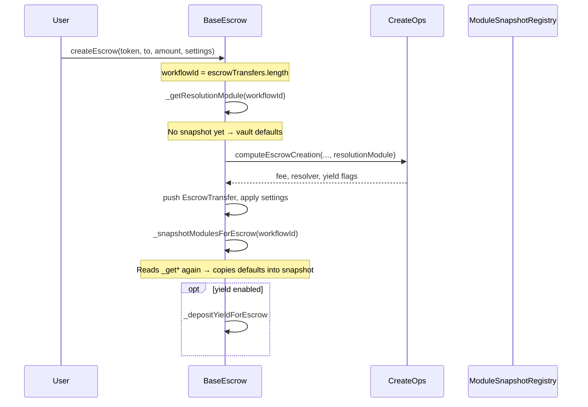

# Per-Escrow Module Selection — Adaptation Exploration

**Date:** 2026-06-01  
**Status:** Design exploration (not implemented)  
**Audience:** Protocol engineers, integrators, governance  

---

## Executive summary

Today, every escrow on a given vault inherits the **same default module set** configured in `ModuleSnapshotRegistry` at creation time. Those addresses are **frozen per `workflowId`** in `moduleSnapshots`, but creators cannot choose alternatives when calling `createEscrow`. The only creation-time “module-adjacent” knobs are `EscrowSettings.customResolver`, `releaseAddress`, `yieldPreset`, and auto-times.

**Per-escrow module selection** means: at **creation only**, the sender (or an approved factory) may specify which allowlisted module implementations govern that escrow’s lifecycle. Governance must not be able to retarget an existing escrow; defaults remain the fallback when the creator omits a choice.

The codebase is **already close architecturally**—snapshot storage, getter indirection, and `ModuleRegistry` allowlisting exist. The gap is **wiring**: creation does not accept module overrides, `CreateOps` resolves the dispute resolver before overrides could apply, and `EscrowVault` getters for some module types ignore snapshots at runtime.

This document maps the current system, proposes adaptation paths, and calls out security, bytecode, and parity constraints.

---

## Goals and non-goals

### Goals

| Goal | Rationale |
|------|-----------|
| Creator-selectable modules at `createEscrow` | Marketplaces, enterprise flows, and DR vs simple escrow in one deployment |
| `address(0)` = use vault default | Backward compatible; no migration for existing integrators |
| Allowlist enforcement | Only `ModuleRegistry` **ACTIVE** modules; ERC-165 interface checks |
| Immutable after creation | Same guarantee as today; no revival of Phase 5 post-creation setters |
| Snapshot remains source of truth | Disputes/yield/release read `moduleSnapshots[workflowId]` for the escrow’s life |
| Registry discovery for UX | `enumerateModules` / metadata for wallets and SDKs |

### Non-goals

| Non-goal | Why |
|--------|-----|
| Post-creation module changes | Removed in Phase 5; breaks user expectations and audit story ([governance.md](../governance/governance.md)) |
| Permissionless module registration | Stays timelock-gated via `ModuleRegistry.addModule` |
| Per-escrow fee overrides | Separate product decision ([PER_ESCROW_SETTINGS_NORMS.md](../reviews/PER_ESCROW_SETTINGS_NORMS.md)) |
| Proxy-upgradeable modules | Protocol uses immutable module swap + snapshot ([MODULE_SWAPPING_STRATEGY.md](../reference/MODULE_SWAPPING_STRATEGY.md)) |

---

## Current architecture

### Module axes (six effective types)

Documented in [PROTOCOL_MODULARITY.md](./PROTOCOL_MODULARITY.md):

| Axis | Interface | Default source | Snapshotted field |
|------|-----------|----------------|-------------------|
| Resolution | `IResolutionModule` | `ModuleSnapshotRegistry` | `resolutionModule` |
| Release | `IReleaseStrategy` | `ModuleSnapshotRegistry` | `releaseStrategy` |
| Cancellation | `ICancellationStrategy` | `ModuleSnapshotRegistry` | `cancellationStrategy` |
| Yield generation | `IYieldModule` / `IYieldGenerationModule` | `ModuleSnapshotRegistry` | `yieldGenerationModule` |
| Yield distribution | `IYieldDistributionModule` | `ModuleSnapshotRegistry` | `yieldDistributionModule` |
| Incentive | `IIncentiveModule` | Derived from resolution module | `incentiveModule` |

Incentive is not user-selected directly: `_snapshotModulesForEscrow` calls `ModuleSnapshotLibrary.getIncentiveModule(resModule)` which staticcalls `incentiveModule()` on the chosen resolution module.

### Creation flow (today)



Relevant code:

```477:520:contracts/core/BaseEscrow.sol
    function createEscrow(
        address token,
        address to,
        uint256 amount,
        EscrowSettings memory settings
    ) public nonReentrant returns (uint256) {
        uint256 workflowId = escrowTransfers.length;
        // ...
        IResolutionModule resolutionModule = _getResolutionModule(workflowId);
        CreateOps.CreateResult memory result = createOps.computeEscrowCreation(
            // ...
            address(resolutionModule)
        );
        // ... push transfer, apply settings ...
        _snapshotModulesForEscrow(workflowId);
```

**Implication:** Until overrides exist *before* the `CreateOps` call, resolver selection always follows vault defaults (or `EscrowableERC20`’s `disputeResolutionModule` fallback).

### What creators can already override (module-adjacent)

From `EscrowSettings` ([EscrowTypes.sol](../../contracts/types/EscrowTypes.sol)):

| Field | Effect |
|-------|--------|
| `customResolver` | Dispute resolver frozen for the escrow; module not consulted for auth when non-zero |
| `releaseAddress` | Passed in `escrowData` to `IReleaseStrategy.canRelease` |
| `yieldPreset` | Opt-in yield + distribution preset via `YieldPresetLibrary` |
| `autoReleaseTime` / `autoCancelTime` | Timeout behavior (mutually exclusive) |

These are **not** full module selection; they tune behavior inside (or beside) the snapshotted modules.

### Two registries, different jobs

| Contract | Role today | Used at creation? |
|----------|------------|-------------------|
| `ModuleSnapshotRegistry` | Per-**vault** default modules; slow-lane queue/activate | Yes (via getters) |
| `ModuleRegistry` | Global allowlist + metadata (`ACTIVE` / `DEPRECATED`) | **No** (deployed, tested, not wired) |

`ModuleRegistry.isApproved` + ERC-165 validation in `addModule` is the right gate for creator-selected addresses.

### Getter patterns: EscrowVault vs EscrowableERC20

**EscrowableERC20** uses `ModuleGetterLibrary`: snapshot field first, then `ModuleSnapshotRegistry` default.

```24:69:contracts/libraries/ModuleGetterLibrary.sol
    function getModuleAddress(
        uint256 workflowId,
        BaseEscrow.ModuleType moduleType,
        mapping(uint256 => ModuleSnapshot) storage moduleSnapshots,
        ModuleSnapshotRegistry moduleManagement,
        address escrowContract
    ) internal view returns (address moduleAddress) {
        // ... load snapshot field by moduleType ...
        if (snapshotModule != address(0)) {
            return snapshotModule;
        }
        return moduleManagement.getModule(escrowContract, moduleType);
    }
```

**EscrowVault** previously used `EscrowVaultModuleLibrary` with a bug (fixed 2026-06-01): release and yield-distribution getters ignored snapshots. **EscrowVault** getter behavior was **inconsistent** before that fix:

| Module type | Snapshot at creation? | Runtime getter uses snapshot? |
|-------------|----------------------|--------------------------------|
| Resolution | Yes | Yes |
| Cancellation | Yes | Yes |
| Yield generation | Yes | Yes |
| Release | Yes (written) | **No** — always `getDefaultReleaseStrategy(vault)` |
| Yield distribution | Yes (written) | **No** — always `getDefaultYieldDistributionModule(vault)` |

So for `EscrowVault`, governance changing default release/yield-distribution modules could affect **existing** escrows on release/settlement paths even though `moduleSnapshots` records a different address. **Per-escrow selection requires fixing this first** (align `EscrowVault` with `ModuleGetterLibrary`).

### Historical note: Phase 5 removal

Post-creation setters were explicitly removed ([governance.md](../governance/governance.md)):

- `setReleaseStrategyForEscrow`
- `setResolutionModuleForEscrow`
- `setYieldGenerationModuleForEscrow`
- `setYieldDistributionModuleForEscrow`

Any new design must restore selection **only at creation**, not as admin setters.

---

## Target behavior

### Semantics

1. Creator passes optional module addresses (or a compact preset id—see options below).
2. For each axis, `effectiveModule = override != 0 ? override : vaultDefault`.
3. Validate `effectiveModule` (allowlist, contract code, ERC-165, compatibility rules).
4. Use `effectiveModule` for:
   - `CreateOps` resolver lookup (resolution axis)
   - `_snapshotModulesForEscrow` (all axes)
   - Yield deposit (generation module)
5. Never mutate `moduleSnapshots[workflowId]` after creation.

### Compatibility rules (normative)

| Rule | Reason |
|------|--------|
| Resolution + incentive | Incentive address comes from resolution module; do not allow a separate incentive override unless interfaces change |
| Yield preset OFF → generation module must be no-op or deposit skipped | Avoid depositing into Aave when user chose `YieldPreset.OFF` |
| Yield preset ON → generation module must support token | `canHandle` / `isTokenSupported` |
| `customResolver` + DRM | Document whether custom resolver bypasses DRM escalation (today: bypasses module auth) |
| Deprecated registry entries | Revert at creation if override or default is `DEPRECATED` |

### Yield module “exclusivity”

Docs describe `YieldModuleAlreadyAssigned` when one yield module is default for multiple vaults ([PROTOCOL_MODULARITY.md](./PROTOCOL_MODULARITY.md)). The error exists on `ModuleSnapshotRegistry` but **default queue/activate does not currently enforce it** in the implementation reviewed.

`AaveYieldModule` keys positions by `(escrowContract, workflowId)` ([AaveYieldModule.sol](../../contracts/modules/AaveYieldModule.sol)), so **many escrows on one vault can share one yield module instance**. Per-escrow selection does not require one deployment per escrow—only correct snapshot + approved escrow on the module.

---

## Design options

### Option A — Extend `EscrowSettings` (recommended baseline)

Add optional module fields to the existing struct:

```solidity
struct EscrowSettings {
    address customResolver;
    address releaseAddress;
    YieldPreset yieldPreset;
    uint256 autoReleaseTime;
    uint256 autoCancelTime;
    // New (all zero = vault default)
    address resolutionModule;
    address releaseStrategy;
    address cancellationStrategy;
    address yieldGenerationModule;
    address yieldDistributionModule;
}
```

**Pros:** Single calldata blob; familiar to integrators; works with existing `createEscrow` signature if only struct encoding changes off-chain.  
**Cons:** Struct growth (+5 words); ABI breaking for strict decoders; more validation gas in creation.

### Option B — Sibling struct `EscrowModuleConfig`

```solidity
function createEscrow(
    address token,
    address to,
    uint256 amount,
    EscrowSettings calldata settings,
    EscrowModuleConfig calldata modules
) external returns (uint256);
```

**Pros:** Clear separation; easier versioning; optional `modules` omitted in wrappers.  
**Cons:** New overload or breaking signature; bridges/factories must update.

### Option C — Preset bundles (`bytes32 presetId`)

Timelock registers named bundles in a small `ModulePresetRegistry` mapping `presetId → {5 addresses}`.

**Pros:** Cheaper calldata; fewer user mistakes; good for wallets (“Standard”, “DRM + Aave”).  
**Cons:** Extra contract; still need raw overrides for power users.

### Option D — Off-chain only (no protocol change)

Factory contract creates escrows with different vault deployments per product line.

**Pros:** Zero core bytecode change.  
**Cons:** Operational overhead; defeats single CREATE2 address story; not true per-escrow on one vault.

**Recommendation:** Implement **Option A or B** for flexibility, plus **Option C** later for UX if calldata cost matters.

---

## Proposed implementation plan

### Phase 0 — Fix snapshot read parity (prerequisite)

| Task | Detail |
|------|--------|
| Unify getters | Make `EscrowVault` use `ModuleGetterLibrary` (or equivalent) for release + yield distribution |
| Add regression tests | Create escrow under default A; governance swaps default to B; assert escrow 1 still uses A |
| Audit snapshot consumers | `EscrowViewContract`, ops libraries, events |

Without this, per-escrow selection would be undermined for release/yield-distribution on `EscrowVault`.

### Phase 1 — Effective module resolution library

New `ModuleSelectionLibrary` (pure/view, no state):

```solidity
struct EffectiveModules {
    address resolution;
    address release;
    address cancellation;
    address yieldGen;
    address yieldDist;
}

function resolve(
    EscrowModuleConfig memory overrides,  // or EscrowSettings extension
    ModuleSnapshotRegistry registry,
    address vault
) internal view returns (EffectiveModules memory);
```

Validation function (callable from `CreateOps` or library):

- `module != 0` → `ModuleRegistry.isApproved(type, module)`
- `module.code.length > 0`
- IERC-165 interface id matches type
- Optional: `supportedTokens` in metadata contains `token` for yield modules

Wire `ModuleRegistry` into `BaseEscrow` / `CreateOps` as an immutable or set-once reference (similar to `moduleManagement`).

### Phase 2 — Reorder creation

Target order:

```text
1. workflowId = escrowTransfers.length
2. effective = resolveModules(settings, vault)
3. validateModules(effective, token, settings.yieldPreset)
4. result = CreateOps.computeEscrowCreation(..., effective.resolution)
5. pull tokens, push EscrowTransfer, apply settings
6. write moduleSnapshots[workflowId] from effective (+ incentive from resolution)
7. optional yield deposit using effective.yieldGen
```

Either:

- **Inline** resolved addresses in `_snapshotModulesForEscrow` instead of calling `_get*Module(workflowId)`, or  
- **Pre-write** a transient snapshot before snapshot finalization (less clean).

Prefer **explicit write from `EffectiveModules`** to avoid chicken-and-egg with empty snapshots.

### Phase 3 — `CreateOps` and validation

- Pass resolved resolution module (already partially done).
- Add `validateModuleSelection(...)` to `SettingsValidationLibrary` or new library used by `CreateOps`.
- Revert codes: `ModuleNotApproved`, `ModuleInterfaceMismatch`, `YieldModuleUnsupportedToken`, `IncompatibleYieldPreset`.

Keep validation in **external** `CreateOps` to protect `BaseEscrow` bytecode.

### Phase 4 — Governance and registry ops

| Action | Owner |
|--------|-------|
| `ModuleRegistry.addModule` for each implementation users may pick | Timelock |
| Vault defaults via `ModuleSnapshotRegistry` | Timelock (unchanged) |
| Document allowed combinations | Dev docs + registry metadata `featureFlags` |

Consider **feature flags** in `ModuleMetadata` (e.g. `SUPPORTS_ESCALATION`, `REQUIRES_BOND`) for wallet filtering without on-chain combinatorial explosion.

### Phase 5 — Integrators

| Layer | Change |
|-------|--------|
| Wallets / SDK | Load `enumerateModules`; build picker UI; encode overrides |
| Indexers | Index `EscrowCreated` + snapshot fields (already on-chain in `moduleSnapshots`) |
| CREATE2 factory | Pass module config in factory helper |
| Bridges (`DeferredFundingBridge`) | Forward module struct if deferred escrows need non-default DR |

### Phase 6 — Tests

| Area | Cases |
|------|-------|
| Defaults | All overrides zero → same behavior as today |
| Single override | Only resolution changes; others stay default |
| Full stack | DRM + Aave + custom cancellation |
| Security | Unapproved module reverts; deprecated module reverts |
| Immutability | No setter exists; snapshot unchanged after governance default swap |
| Parity | `EscrowVault` vs `EscrowableERC20` |
| Yield | OFF preset cannot use Aave; ON with unsupported token reverts |
| Resolver | `customResolver` + module resolver precedence unchanged |

---

## Security and governance

### Threat model

| Threat | Mitigation |
|--------|------------|
| Malicious module drains vault | Allowlist only; modules never hold arbitrary withdrawal rights without escrow flow |
| User tricked into bad module | UX + registry metadata; optional preset allowlists per integrator |
| Governance swaps defaults to break old escrows | Snapshot + Phase 0 getter fix |
| Module implements interface but behaves maliciously | Off-chain audit per `addModule`; timelock responsibility |
| Reentrancy at creation | Keep `nonReentrant` on `createEscrow`; validate before external calls to modules (prefer staticcall for resolver lookup—already in CreateOps) |

### Governance boundaries (unchanged)

- Timelock may add/deprecate modules in `ModuleRegistry`.
- Timelock may change **vault defaults** via slow lane.
- Timelock **cannot** change module set for an existing `workflowId`.

### Bytecode budget

`BaseEscrow` is near EIP-170 limits (`via_ir`, `optimizer_runs = 1`). Expect:

| Component | Est. impact |
|-----------|-------------|
| Module resolution + validation library | External library (minimal core impact) |
| `CreateOps` validation | +200–800 B (interface checks) |
| `EscrowSettings` expansion | Calldata cost ↑; storage unchanged (snapshot already stores addresses) |
| Immutability `moduleRegistry` reference | One address slot on vault |

If over limit: move all selection logic to `CreateOps.computeEscrowCreation` return struct including `EffectiveModules` for core to copy into snapshot.

---

## API sketch (Option B)

```solidity
struct EscrowModuleConfig {
    address resolutionModule;
    address releaseStrategy;
    address cancellationStrategy;
    address yieldGenerationModule;
    address yieldDistributionModule;
}

/// @notice address(0) on any field = use vault default from ModuleSnapshotRegistry
function createEscrow(
    address token,
    address to,
    uint256 amount,
    EscrowSettings calldata settings,
    EscrowModuleConfig calldata modules
) external returns (uint256 workflowId);
```

View helper for integrators:

```solidity
function previewModules(
    address vault,
    EscrowModuleConfig calldata modules
) external view returns (ModuleSnapshot memory effective);
```

---

## Open questions

1. **Partial overrides:** If user sets `yieldGenerationModule` to Aave but leaves distribution at default, is the default distribution module guaranteed compatible with Aave yield accounting in `YieldOps`?
2. **EscrowableERC20:** Should module overrides be allowed on the token-as-escrow variant, or only `EscrowVault`?
3. **Fee tiers per module bundle:** Product question—charge different `escrowFee` by preset?
4. **Registry vs vault default:** If vault default is not in global allowlist (legacy deployment), can creation still use defaults?
5. **Events:** Emit `EscrowModulesSelected(workflowId, effective...)` for easier indexing vs reading storage?

---

## Relationship to existing docs

| Document | Relevance |
|----------|-----------|
| [PROTOCOL_MODULARITY.md](./PROTOCOL_MODULARITY.md) | Module types, snapshot model, getter conventions |
| [governance.md](../governance/governance.md) | Immutability rules; Phase 5 removals |
| [MODULE_SWAPPING_STRATEGY.md](../reference/MODULE_SWAPPING_STRATEGY.md) | Append-only modules; no post-creation migration |
| [ESCROW_CREATION_AND_SETTINGS.md](./ESCROW_CREATION_AND_SETTINGS.md) | Creation pipeline (update after implementation) |
| [FUTURE_PROOF_DESIGN_PROPOSAL.md](../reviews/FUTURE_PROOF_DESIGN_PROPOSAL.md) | Earlier registry + per-escrow selection vision |
| [ARCHITECTURE_YIELD_MODULES.md](./ARCHITECTURE_YIELD_MODULES.md) | Phase 4 “module selection at creation” (yield-focused) |

---

## Summary

| Aspect | Today | After adaptation |
|--------|-------|------------------|
| Who picks modules | Timelock (vault defaults) | Creator at creation + timelock allowlist |
| Where stored | `moduleSnapshots[workflowId]` | Same |
| Post-creation changes | Forbidden | Still forbidden |
| `ModuleRegistry` | Metadata only | Enforced at creation |
| `EscrowVault` getters | Partial snapshot bypass | Must read snapshot first |
| `CreateOps` | Uses pre-snapshot defaults | Uses resolved effective resolution module |

The adaptation is **incremental**: fix getter parity, add resolution/validation library, extend creation inputs, wire `ModuleRegistry`, and expand tests. No change to the core security story—**snapshots freeze behavior per escrow; governance only shapes the menu of allowed choices and the defaults when the menu is not used.**

---

_Last updated: 2026-06-01_
