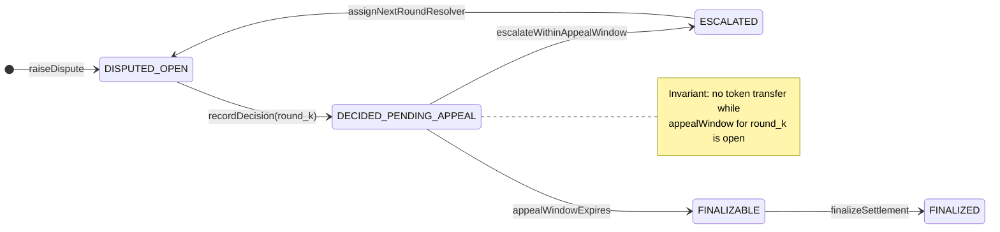
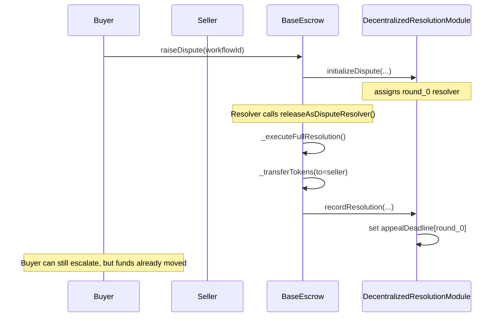
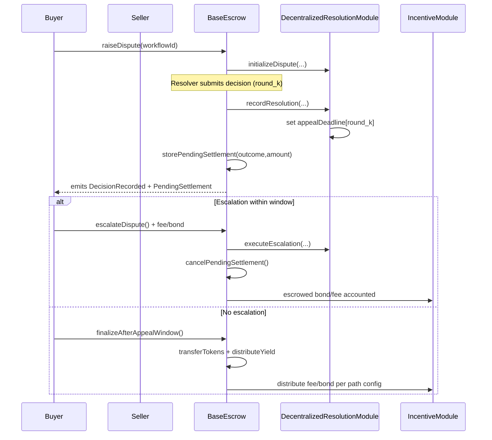

# Resolution Flow Analysis

**Date:** Current  
**Purpose:** Compare described resolution flow with actual implementation  
**Status:** Analysis Only (No Code Changes)

---

## Completeness: 2026 Ethereum-native “must haves”

This section captures the **table-stakes expectations** for any “court-like” dispute system on Ethereum, and how they map onto our current architecture / planned fixes.

### 1) Evidence integrity + authenticity (without trusting UI)
- **On-chain evidence commitments**: hashes of evidence bundles + timestamp + submitter.
- **Ordered evidence log**: append-only; clear cutoffs for when new evidence is admissible.
- **Attestation plumbing**: the protocol supports attaching signed statements as evidence (even if v1 UX doesn’t expose it yet).

**Status in repo:** Evidence is designed as a **module boundary** (`IEvidenceModule` / `EvidenceModuleV1`) and should be treated as a first-class primitive. This analysis doc focuses primarily on **finality discipline** (see below), but the settlement/finality work must not assume “evidence is a PDF upload”.

### 2) Expert attestations (optional per category, but first-class)
- **Now (A only)**: Expert attestations are **EIP-712 (or equivalent) signed statements** that can be **submitted/anchored as evidence** and considered by resolvers; they **do not move funds** directly.
- **Future note**: category-scoped expert registries (appointed experts per category) can be added later to improve credibility without centralizing outcomes.

### 3) Finality discipline (no funds move during appeal)
By 2026 this is non-negotiable:
- **Decision recorded → appeal window → finalize**
- **Escrow settlement delayed until appeal expiry**
- **Escalation cancels pending settlement deterministically**

**Status in repo:** This is the **current critical gap**. `BaseEscrow` transfers funds before the resolution module’s `appealDeadline` is even set.

### 4) Liveness under adversary (timeouts, reassignment, anti-stall)
Must have:
- deadlines
- explicit timeout handling
- deterministic reassignment + max retries + escalation fallback
- strong penalties for non-response (workload throttling in v1; slash/freeze in v3)

### 5) Cost discipline (anti-griefing)
Appeal rights can become griefing rights unless:
- escalation costs are non-trivial
- costs can scale by amount/category
- repeated escalations become progressively more expensive (fee curve and/or bond curve)

### 6) Resolver fairness + predictable ROI assumptions (anti-rug)
Ethereum-native operators will expect:
- predictable parameter-change cadence (slow lane)
- bounded scope of what can change
- clear “versioning” so operators know what they’re opting into

**Low-priority TODO (constitution layer):** Introduce a “constitution layer” concept for **new configuration validation** and governance rate-limits (e.g., monotonic fee/bond curves, max rounds ≤ N, bounded deadlines/windows, slow sunset of tiers, optional routing-change rate limits). For now: document/process guardrail; consider on-chain enforcement later.

---

## Described Flow (Target Behavior)

### Scenario: Resolver Decides in Favor of Seller

1. **Buyer creates escrow to seller**
2. **Buyer raises dispute**
3. **Resolver decides in favor of seller**
4. **[Currently funds transferred to seller immediately]** ⚠️ **ISSUE IDENTIFIED**
5. **Buyer escalates - places appeal bond** (or escalation fee in v1)
6. **Senior resolver looks at the escalation**
7. **Either:**
   - **1a. Senior resolver rules in favor of buyer**
     - Buyer gets their escalation bond back (minus fee)
     - Seller has option to escalate/appeal to Kleros
     - Seller chooses not to escalate
     - After deadline passes, **[here funds should be transferred to buyer, including escrow and any yield]**
   
   - **1b. Senior resolver rules in favor of seller**
     - Buyer loses bond
     - Buyer has option to escalate to Kleros
     - Buyer chooses not to escalate
     - After deadline passes, **[here funds should be transferred to seller, including escrow and any yield]**

### Version Note
The version prior to release of escalation bonds should be the same, except **no escalation bond (only an escalation fee)**.

---

## Escalation pathway: future-proof encoding (config-first, snapshot-per-escrow)

Goal: keep the system **flexible** (Bucket A: safe governance tunables) without drifting into “parameter roulette” (Bucket B: dangerous flexibility).

### Design stance (2026-native)
- **Config-first** where possible (deadlines, windows, curves, routing, max rounds).
- Avoid “data-only VM” designs for new arbitration mechanics.
- Keep complex mechanics explicit/auditable via **typed round handlers** (even if not all are implemented now).
- **Snapshot per escrow**: changes affect **new escrows only**, preserving non-retroactivity.

### Minimal path abstraction (docs-only; not implemented yet)
Represent an escalation pathway as:
- `pathId` (selected at escrow creation using category/amount routing)
- `rounds[]` where each round defines:
  - **roundType**: `SingleResolver` | `ExternalArbitration` | (future) `Committee`
  - **resolveDeadline** and **appealWindow**
  - **economic requirements**:
    - **v1**: escalation fee schedule (may be curve-based)
    - **v2+**: appeal bond schedule (curve-based), plus distribution policy (refund vs pay prior round)
  - (future) **EvidencePolicy**: evidence cutoff rules and allowed evidence types (incl. attestations)

#### Category/amount routing (new escrows only)
To support “more complex pathway for larger escrows” without changing mechanics mid-escrow:
- Define amount buckets (example): `Small`, `Medium`, `Large` (token/value normalized).
- Maintain routing table:
  - `(categoryKey, amountBucket) -> pathId`
- On escrow creation, the resolution module (or a routing helper) selects a `pathId` and the escrow snapshots it.

This preserves the immutability doctrine while allowing governance to iteratively tune “lanes” for different dispute profiles.

### Incentives boundary (important)
- **Resolution module**: assignment, round transitions, deadlines, appeal windows, and canonical dispute metadata.
- **Incentive module**: computes and executes payout/distribution for fees/bonds, based on the dispute timeline and (snapshotted) path config.

This separation is how we evolve incentive economics without rewriting the dispute “court” mechanics.

### Incentive module contract (docs-only)

The incentive module should be able to compute payouts deterministically from:
- **snapshotted path config** (which lane, which curves, which distribution policy)
- **round outcomes** (decision at round k vs k+1)
- **who escalated** (payer of fee/bond)
- **timing** (whether escalation was inside the appeal window)

Minimal “inputs” the incentive module needs (can be emitted as events or queryable from the resolution module/escrow):
- `workflowId`
- `pathId`
- `currentRound`
- `decisionAtRound[k]`, `resolverSet[k]` (or resolver address)
- `appealFeePaid[k]` and (future) `appealBondPaid[k]` (amount + token + payer)
- `finalOutcome` and `finalRound`

Recommended v1/v2 semantics (aligned with `RESOLVER_ECONOMICS.md`):
- **Fee-only (v1)**: escalation fee is charged to escalator; distribution can be simple (treasury / ops).
- **Bonded appeals (v2)**:
  - If `decision[k+1] != decision[k]` (appeal succeeds): refund bond to escalator (minus any processing fee).
  - Else (appeal fails): bond is paid to the prior resolver set `resolverSet[k]` (optionally with a protocol cut).

These rules keep “appeal because angry” irrational, while preserving a credible path to correct errors.

---

## Dispute lifecycle: current vs target (finality discipline)

This section describes the dispute lifecycle as a state machine and highlights the **finality discipline** invariant we must enforce: **no funds move during an appeal window**.

### Target state machine (settlement delayed until finality)

Key concept: after any decision that is appealable, the escrow enters a **pending settlement** state. Escalation deterministically cancels pending settlement.



### Current behavior (problematic sequence)

Today, `BaseEscrow` transfers tokens **immediately** when a resolver calls `releaseAsDisputeResolver()` / `cancelAsDisputeResolver()`. Only afterwards does it notify the resolution module, which then sets the appeal deadline.



### Target behavior (appeal-window-safe settlement)

The target sequence flips the order: decision is recorded first (creating an appeal deadline), settlement is delayed, and escalation cancels the pending settlement deterministically.



---

## Current Implementation Analysis

### Code Flow (As Implemented)

#### 1. Resolution Decision (`BaseEscrow._executeFullResolution`)

**Location:** `contracts/core/BaseEscrow.sol:308-341`

```solidity
function _executeFullResolution(
    uint256 workflowId,
    EscrowTransfer storage et,
    bool isRelease,
    uint256 amount,
    bytes32 resolutionHash
) internal {
    address recipient = isRelease ? et.to : et.from;
    address token = et.token;
    
    // Update state
    et.remainingBalance = 0;
    et.escrowState = EscrowState.RESOLVED;  // ❌ Sets to RESOLVED immediately
    totalEscrowsPending--;
    _updateEscrowBalance(token, amount, false);
    delete disputeRaisedTimestamp[workflowId];
    
    emit EscrowStateChanged(workflowId, EscrowState.DISPUTED, EscrowState.RESOLVED);
    
    // Handle yield
    if (address(yieldOps) != address(0)) {
        // ... yield handling
    }
    
    // Transfer tokens
    _transferTokens(token, recipient, amount);  // ❌ TRANSFERS IMMEDIATELY
    
    // Record outcome and emit events
    _recordResolutionOutcome(workflowId, _msgSender(), isRelease, resolutionHash);  // ❌ Called AFTER transfer
    emit EscrowResolved(workflowId, _msgSender(), resolutionHash);
    emit EscrowTransferResolved(workflowId, et.from, et.to, et.totalDeposited);
}
```

#### 2. Recording Resolution Outcome (`BaseEscrow._recordResolutionOutcome`)

**Location:** `contracts/core/BaseEscrow.sol:608-615`

```solidity
function _recordResolutionOutcome(uint256 workflowId, address disputeResolver, bool isRelease, bytes32 /* resolutionHash */) internal {
    address module = address(_getResolutionModule(workflowId)); 
    if (module == address(0)) return;
    (bool success, ) = module.call(abi.encodeWithSignature("recordResolution(uint256,address,uint8,bool,uint256)", workflowId, disputeResolver, isRelease ? 1 : 2, false, 0));
    success;
}
```

#### 3. Module Record Resolution (`DecentralizedResolutionModule.recordResolution`)

**Location:** `contracts/decentralized-resolution-module/DecentralizedResolutionModule.sol:718-752`

```solidity
function recordResolution(uint256 workflowId, address resolver, ResolutionOutcome outcome, uint256 resolutionTime) external onlyEscrowContract {
    DisputeMetadata storage dm = disputeMetadata[workflowId];
    uint8 currentRound = dm.currentRound;
    
    // Update round-based decision tracking
    dm.decisionAtRound[currentRound] = outcome;
    dm.decidedAtRound[currentRound] = block.timestamp;
    dm.appealDeadline[currentRound] = block.timestamp + appealWindows[currentRound];  // ✅ Sets appeal deadline
    dm.status = DisputeStatus.Decided;  // ✅ Sets status to Decided (not Final)
    
    // ... rest of function
}
```

---

## Critical Differences

### ❌ **Issue 1: Tokens Transferred Before Appeal Window**

**Current Behavior:**
- `_transferTokens()` is called **BEFORE** `recordResolution()` sets the appeal deadline
- Escrow state is set to `RESOLVED` **immediately** upon resolution decision
- Funds are transferred **before** appeal window expires

**Expected Behavior:**
- `recordResolution()` should be called **first** (sets appeal deadline)
- Tokens should **only** be transferred **after** appeal window expires
- Escrow state should remain `DISPUTED` (or similar) until appeal window passes

**Impact:**
- If buyer escalates after tokens are already transferred, the seller already has the funds
- Cannot reverse or cancel a resolution that has already been executed
- Appeal window becomes meaningless for token transfers

### ✅ **Issue 2: Appeal Window Tracking (Correctly Implemented)**

**Current Behavior:**
- `dm.appealDeadline[currentRound]` is set correctly: `block.timestamp + appealWindows[currentRound]`
- `dm.status` is set to `DisputeStatus.Decided` (not `Final`)
- Appeal windows: `[2 days, 3 days, 0]` for rounds [0, 1, 2] (0 = no appeal for Kleros)

**Expected Behavior:**
- ✅ Matches expected behavior (deadline tracking is correct)

### ⚠️ **Issue 3: Escalation Handling**

**Current Behavior:**
- `escalateDispute()` in BaseEscrow (line 485) handles escalation
- Escalation fee is collected and marked as paid
- `executeEscalation()` in DecentralizedResolutionModule (line 262) moves dispute to next round
- Status changes to `DisputeStatus.Escalated`

**Expected Behavior:**
- Should handle escalation during appeal window
- If escalation happens, should cancel/revoke pending resolution
- Funds should not have been transferred yet (but currently they have)

**Impact:**
- If tokens are already transferred, escalation cannot reverse the transfer
- Need to prevent token transfer until appeal window passes

### ✅ **Issue 4: Final Level Handling (Correctly Implemented)**

**Current Behavior:**
- Round 2 (Kleros) has `appealWindows[2] = 0` (no appeal window)
- Status can be set to `DisputeStatus.Final` for final decisions

**Expected Behavior:**
- ✅ Final-level resolutions (Kleros, round 2) can transfer immediately (no appeal window)
- ✅ This matches expected behavior

---

## Summary of Differences

| Aspect | Described Flow | Current Implementation | Status |
|--------|---------------|----------------------|--------|
| **Token Transfer Timing** | After appeal window expires | Immediately upon resolution | ❌ **DIFFERS** |
| **Appeal Deadline Tracking** | Set when resolution recorded | Set correctly in `recordResolution()` | ✅ **MATCHES** |
| **Escrow State After Resolution** | Remains disputed/pending until appeal window passes | Set to `RESOLVED` immediately | ❌ **DIFFERS** |
| **Escalation During Appeal Window** | Should cancel pending resolution | Can escalate, but tokens already transferred | ❌ **DIFFERS** |
| **Final Level (Kleros)** | Transfer immediately (no appeal window) | `appealWindows[2] = 0` (no appeal window) | ✅ **MATCHES** |
| **Escalation Fee/Bond** | Fee in v1, bond in v2 | Escalation fee collected correctly | ✅ **MATCHES** |

---

## Required Changes

To match the described flow, the following changes are needed:

1. **Modify `_executeResolution` in `BaseEscrow.sol`:**
   - Call `recordResolution()` **first** (before token transfer)
   - Check appeal deadline from resolution module
   - Only transfer tokens if appeal deadline has passed (or final level)
   - Keep escrow state as `DISPUTED` until appeal window passes

2. **Add function to execute pending resolution:**
   - Function to transfer tokens after appeal window expires
   - Should check that appeal deadline has passed
   - Should check that no escalation occurred during window

3. **Update `escalateDispute`:**
   - If escalation happens during appeal window, cancel pending resolution
   - Ensure tokens have not been transferred yet (or reverse if they have)

4. **Handle final-level resolutions:**
   - Round 2 (Kleros) with `appealWindows[2] = 0` should transfer immediately
   - No delay for final-level decisions

5. **(Docs-aligned future work) Evidence & attestations**
   - Ensure the finalized flow references **evidence commitments** (append-only log, admissibility cutoffs).
   - Support **attestations as evidence** (A-only for now), non-binding to settlement.
   - Future: category-scoped expert registries.

---

## Implementation Notes

### Appeal Windows
- Round 0 (Initial Resolver): 2 days appeal window
- Round 1 (Senior Resolver): 3 days appeal window  
- Round 2 (Kleros/External): 0 days (no appeal window, final decision)

### Status Flow (Expected)
```
Open → Decided (appeal window open) → Final (after deadline) OR Escalated (if escalated)
```

### Status Flow (Current - Problematic)
```
Open → RESOLVED (tokens transferred) → Escalated (cannot reverse transfer)
```

---

## Related Documentation

- `DR_V3_TODO.md` - Section 5.4: Appeal Window Enforcement (Critical)
- `DR_V3_PHASE5_SUMMARY.md` - Phase 5 implementation details
- `DR_STAGING_PLAN.md` - Overall staging plan
- `RESOLVER_ECONOMICS.md` - 2026 expectations: appeal bonds, curves, liveness, governance boundaries
- `RESOLVER_ECONOMICS_TODOS.md` - Engineering TODOs for v1/v2 incentive plumbing and appeal-bond infrastructure

---

## Conclusion

The current implementation **differs significantly** from the described flow in the critical area of **token transfer timing**. Tokens are currently transferred immediately upon resolution decision, before the appeal window expires. This makes the appeal window ineffective for preventing premature transfers.

The appeal window tracking and escalation fee/bond handling are implemented correctly, but the token transfer logic needs to be modified to defer transfers until the appeal window expires.
