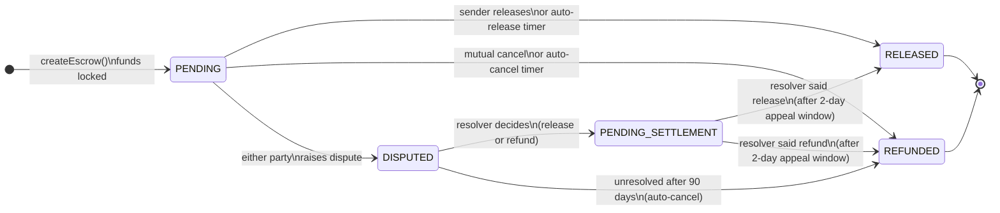
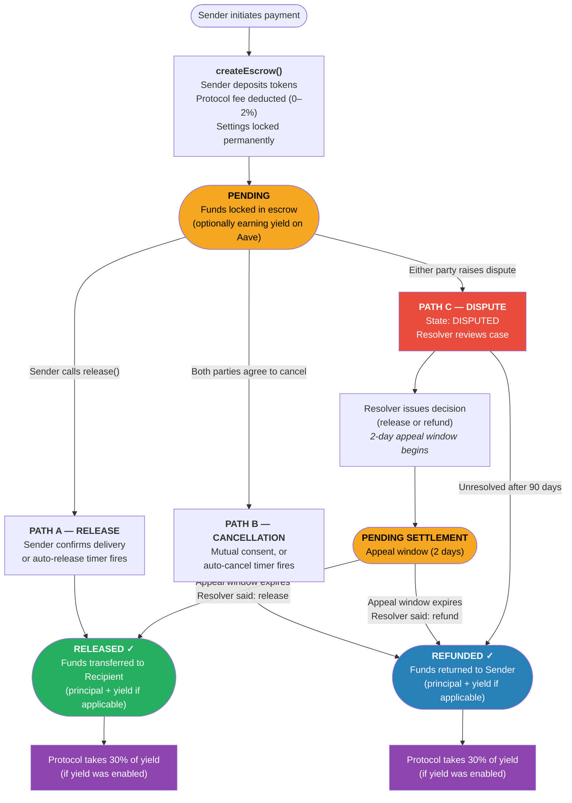

# Sew Protocol — Payment Flow Overview

*For review by payments counsel. Simplified for legal purposes; dispute resolution details are summarised.*

---

## What is SEW Protocol?

**Sew Protocol** is a smart contract system for on-chain escrow payments. Funds are locked on-chain until agreed conditions are met — neither party can unilaterally access funds mid-flow. It operates on Base (an Ethereum L2).

---

## Key Actors

| Actor | Role |
|---|---|
| **Sender** | Initiates the payment; funds the escrow |
| **Recipient** | Receives funds upon confirmed delivery |
| **Dispute Resolver** | Arbitrates disagreements (configurable per-escrow: custom address or protocol default) |
| **Protocol / Governance** | Collects fees; controls upgrades to shared modules |

---

## Payment States



---

## End-to-End Payment Flow



---

## Fund Flow Summary

```
 Sender deposits:    [   AMOUNT   ]
                     [  fee (≤2%) ] ──► Protocol fee wallet
                     [ amountNet  ] ──► Held in escrow
                                              │
                              ┌───────────────┴────────────────┐
                              │  IF YIELD ENABLED (optional)   │
                              │  amountNet deposited to Aave   │
                              │  → interest accrues            │
                              └───────────────┬────────────────┘
                                              │
                              On finalization (release or refund):
                                              │
                         ┌────────────────────┴────────────────────┐
                         │                                         │
                  [RELEASED]                               [REFUNDED]
                         │                                         │
             Principal ──────────────────────────────► Recipient  │
             Yield net* ──────────────────────────────► Recipient  │
             Yield fee* (30%) ──────────────────────► Protocol     │
                                             Principal ──────────► Sender
                                             Yield net* ─────────► Sender
                                             Yield fee* (30%) ──► Protocol

             * only if yield was enabled on this escrow
```

---

## Key Protocol Parameters

| Parameter | Default | Notes |
|---|---|---|
| Escrow creation fee | ~0.2% (configurable 0–2%) | Deducted at creation |
| Yield protocol fee | 30% of yield generated | Only if yield enabled |
| Dispute appeal window | 2 days | After resolver decides, before settlement executes |
| Auto dispute cancellation | 90 days | If dispute unresolved, auto-refunds sender |
| Supported tokens | Any ERC20 | USDC, USDT, DAI, WETH, etc. |
| Yield source | Aave (optional) | Only for Aave-supported tokens |

---

## What is Immutable vs. Configurable

**Immutable per escrow (locked at creation):**
- Which token, amount, sender, recipient
- Which dispute resolver applies
- Whether yield is enabled and the yield fee rate
- Which release strategy and cancellation strategy apply

**Configurable by governance (affects only new escrows):**
- Default fee rates
- Default modules (yield, resolution, distribution)
- Protocol fee wallet address

**Governance changes never affect existing escrows.**

---

*This document is a simplified overview. The protocol is non-custodial; funds are held in audited smart contracts, not by any centralised party.*
